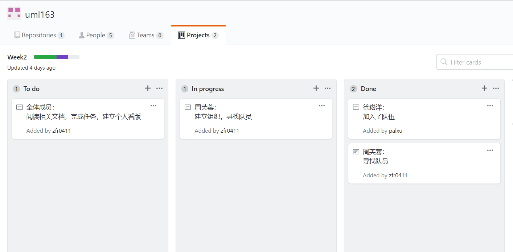
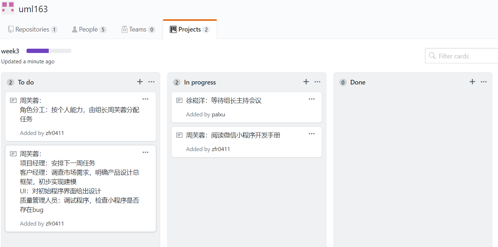
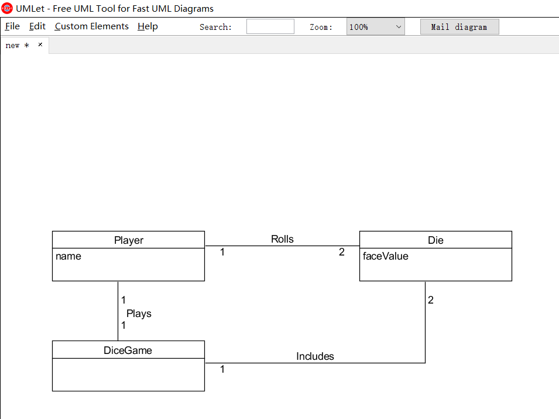

## Homework2
##### 1.用简短的语言给出对分析、设计的理解。
>* 分析：研究程序或业务的过程，以确定其目标和目的，并创建能用有效的方式实现它们的系统和程序。
>* 设计：设计是定义体系结构、模块、接口和数据以满足指定需求的过程，可以看成系统理论到产品开发的应用。

##### 2.用一句话描述面向对象的分析与设计的优势。
> 面向对象的分析与设计（OOAD）强调的是在问题领域内发现和描述对象（概念）并定义软件对象以及它们如何写作以实现需求，从而避免从过程、数据结构等细节上进行复杂的讨论。

##### 3.简述 UML（统一建模语言）的作用。考试考哪些图？
>* UML提供了一种可视化系统设计的标准方法，是一种开放的建模语言，用于说明、可视化、构建和编写一个正在开发的、面向对象的、软件密集系统的制品的开放方法。
>* 考试主要考Structure diagrams（结构图）、Behavior diagrams（行为图）、Interaction diagrams（交互图）。

##### 从软件本质的角度，解释软件范围（需求）控制的可行性
> 软件的本质特性以及软件需求的易变性所可能带来的潜在的巨大风险意味着完全控制软件范围是一件几乎不可能的事情，但我们必须在一定程度上控制软件范围。
> 软件分析的目的不是找出所有的需求并完善而是确认有效的功能与需求，去伪存真不断满足客户需要。软件设计也不是追求最先进技术，而是控制变化附加的成本，使得软件生产的预算、时间等能在掌控之中。

##### 项目管理实践
> * 看板使用练习（提交看板执行结果贴图，建议使用 Git project）
> * 使用截图工具（png格式输出），展现你团队的任务 Kanban
>* 每个人的任务是明确的。必须一周后可以看到具体结果
>* 每个人的任务是1-2项
>* 至少包含一个团队活动任务
> 
> 
>* UML绘图工具练习（提交贴图，必须使用 UMLet）
* 请在 参考书2 或 教材 中选择一个类图（给出参考书页码图号）
> 
> 参考：课本P6 图1-3 骰子游戏的局部领域模型
